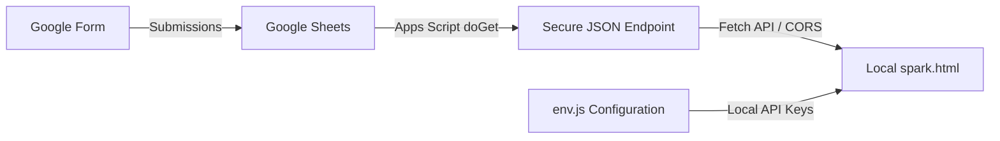

# ⚡ DEVCON Laguna — Member Analytics Dashboard

Welcome! This repository houses the live data visualization and analytics engine for **DEVCON Laguna** registrations. As the **Membership Data Analyst**, this project is designed to extract actionable insights from applicant data in real-time, helping shape event operations, technical curriculum, and core community programming.

---

## 📊 Project Overview: Cohort 1 (`spark`)

The Cohort 1 dashboard (**`spark.html`**) is a lightweight, high-performance, real-time analytics client built using **Chart.js** and styled with a custom dark-mode aesthetic. 

It tracks and visualizes:
1. **Composition**: The ratio of undergraduate tech students, professionals, freelancers, and enthusiasts.
2. **Geography**: Mapping key cities (e.g., Santa Rosa, Cabuyao, Biñan) to find cohort clusters.
3. **Interests**: Technical areas of focus (Frontend, Backend, AI/ML, UI/UX, Cloud, etc.).
4. **Skill Levels**: Self-rated experience levels (1–5 scale).
5. **Organizing Capacity**: Identifying volunteers ready to run events and matches them to committees.
6. **Campaign Impact**: Dynamic tracking of marketing efforts (e.g., registrations before vs. after the July 12 promotional video launch).

---

## 🛠️ Architecture & Security Design

To keep deployment simple while protecting sensitive information, the project follows a decoupled architecture:



### 🔒 Privacy-First Design
* **Zero PII Leaks**: The Google Apps Script acts as an aggregation layer. It calculates counts, percentages, and extracts keywords *on the Google side*. It **never** reads or returns participant names, emails, or phone numbers to the browser.
* **Secret Management**: The Google Sheets `/exec` URL is stored locally in `env.js`, which is ignored by Git (`.gitignore`). This prevents developer configurations from leaking online.

---

## 🚀 Setup & Local Development

To run the Cohort 1 dashboard locally, follow these steps:

### 1. Configure the Environment
By default, the dashboard needs to know where to fetch your aggregated Google Sheets API data.

1. Navigate to the `cohort_one` directory.
2. Duplicate the template configuration file:
   ```bash
   cp env.example.js env.js
   ```
3. Open `env.js` in your editor and replace the placeholder URL with your live Google Apps Script web app URL:
   ```javascript
   const ENV = {
     SHEET_API_URL: 'https://script.google.com/macros/s/YOUR_DEPLOYED_URL_HERE/exec'
   };
   ```

### 2. Run the Dashboard
Open `spark.html` directly in any web browser:
* Double-click `spark.html` in your file explorer, OR
* Open it from your terminal:
  ```bash
  # Windows
  start cohort_one/spark.html
  ```

---

## 📁 File Structure

```text
devcon-presentation/
├── cohort_one/
│   ├── spark.html        # HTML structure & DOM layout
│   ├── spark.css         # Custom CSS (premium dark theme, typography, layout)
│   ├── spark.js          # Core execution logic, Chart.js configs, & polling loop
│   ├── env.js            # Local environment config (git-ignored)
│   ├── env.example.js    # Environment template for developers
│   └── .gitignore        # Local folder rules (excludes env.js)
├── devcon.png            # Banner banner image
└── README.md             # Project documentation & roadmap
```

---

## 🔮 Future Cohort Roadmap

We are just getting started! As DEVCON Laguna grows, we will scale our analytics toolchain:
* **Cohort 2 Integration**: Modularize the data pipeline to support multi-cohort filtering and comparisons.
* **Direct database integration**: Move from Google Sheets to a server-side DB (PostgreSQL/Supabase) to support larger applicant pools.
* **Civic Tech Matching**: Build an automated matching engine to connect volunteer applicants with local community projects based on their interests and skills.

---
*Created with 💻 by DEVCON Laguna Chapter Membership Team.*
