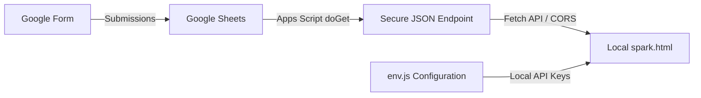

# DEVCON Laguna - Membership Analytics Dashboard

This repository houses the live data visualization and analytics engine for DEVCON Laguna registrations. As the Membership Data Analyst, this project extracts actionable insights from applicant data in real-time to shape event operations, technical curriculum, and core community programming.

---

## Project Overview: Cohort 1 (spark)

The Cohort 1 dashboard (spark.html) is a lightweight, real-time analytics client built using Chart.js and styled with a custom dark-mode aesthetic.

It tracks and visualizes:

1. **Composition**: The ratio of undergraduate tech students, professionals, freelancers, and enthusiasts.
2. **Geography**: Mapping key cities (e.g., Santa Rosa, Cabuyao, Biñan) to find cohort clusters.
3. **Interests**: Technical areas of focus (Frontend, Backend, AI/ML, UI/UX, Cloud, etc.).
4. **Skill Levels**: Self-rated experience levels (1-5 scale).
5. **Organizing Capacity**: Identifying volunteers ready to run events and matching them to committees.
6. **Campaign Impact**: Dynamic tracking of marketing efforts (e.g., registrations before vs. after the July 12 promotional video launch).

---

## Architecture & Security Design

To keep deployment simple while protecting sensitive information, the project follows a decoupled architecture:



### Privacy-First Design

- **Zero PII Leaks**: The Google Apps Script acts as an aggregation layer. It calculates counts, percentages, and extracts keywords on the Google Sheets side. It never reads or returns participant names, email addresses, or phone numbers to the browser.
- **Secret Management**: The Google Sheets URL is stored locally in `env.js`, which is ignored by Git via `.gitignore`. This prevents developer configurations from leaking online.

---

## File Structure

```text
devcon-presentation/
├── cohort_one/
│   ├── spark.html        # HTML structure and DOM layout
│   ├── spark.css         # Custom CSS (premium dark theme, typography, layout)
│   ├── spark.js          # Core execution logic, Chart.js configs, and polling loop
│   ├── env.js            # Local environment config (git-ignored)
│   ├── env.example.js    # Environment template for developers
│   └── .gitignore        # Local folder rules (excludes env.js)
├── devcon.png            # Banner image
└── README.md             # Project documentation and roadmap
```

---

## Future Cohort Roadmap

As DEVCON Laguna grows, we will scale our analytics toolchain:

- **Cohort 2 Integration**: Modularize the data pipeline to support multi-cohort filtering and comparisons.
- **Direct Database Integration**: Move from Google Sheets to a server-side database (PostgreSQL/Supabase) to support larger applicant pools.
- **Civic Tech Matching**: Build an automated matching engine to connect volunteer applicants with local community projects based on their interests and skills.

---

_Created by the DEVCON Laguna Chapter Membership Team._
